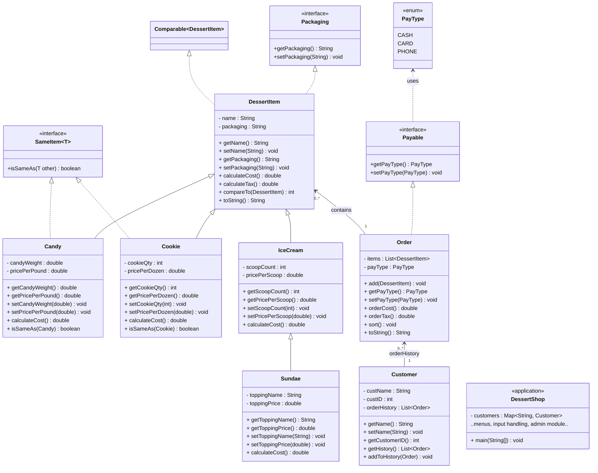

# Dessert Shop POS System
A Java point-of-sale system for a dessert shop demonstrating OOP principles including inheritance, polymorphism, interfaces, and generics. Features customer management, order processing, and receipt generation. Each week introduced new Java concepts such as abstract classes, interfaces, generics, collections, and polymorphism—all of which were integrated into one cohesive application by the end of the term


[](https://www.oracle.com/java/)
[](https://junit.org/junit5/)
[](https://maven.apache.org/)

## About

- **Course:** CS-115-Object-Oriented Programming (Java)
- **Institution:** Ensign College
- **Author:** Oliver Rivera  
- **Semester:** Winter 2024


## Project Structure
```
dessert-shop-pos-system/
├── src/
│   └── DessertShop/
│       ├── Candy.java           # Represents candy items (weight-based pricing)
│       ├── Cookie.java          # Represents cookies (priced per dozen)
│       ├── IceCream.java        # Base class for ice cream items
│       ├── Sundae.java          # Extends IceCream with toppings
│       ├── DessertItem.java     # Abstract parent class for all dessert types
│       ├── Packaging.java       # Interface defining get/set packaging behavior
│       ├── Payable.java         # Interface with PayType enum (CASH, CARD, PHONE)
│       ├── SameItem.java        # Generic interface for combining similar items
│       ├── Order.java           # Manages dessert lists, totals, and payment
│       ├── Customer.java        # Stores customer info and order history
│       └── DessertShop.java     # Main application (menu, user input, admin module)
│
├── test/
│   └── DessertShop/
│       ├── CandyTest.java       # Unit tests for Candy
│       ├── CookieTest.java      # Unit tests for Cookie
│       ├── IceCreamTest.java    # Unit tests for IceCream
│       ├── SundaeTest.java      # Unit tests for Sundae
│       ├── DessertItemTest.java # Base class test (abstract behaviors)
│       └── CustomerTest.java    # Tests for customer and order logic
│
├── bin/                         # Compiled .class files (generated after build)
├── README.md                    # Project documentation and UML diagram
└── pom.xml                      # Maven build configuration
```
---
## Set Up & Run

Clone the repository and navigate to the project directory:
```bash
git clone https://github.com/olael94/dessert-shop-pos-system.git
cd dessert-shop-pos-system
```
Ensure you have JDK 21+ installed.
```bash
java -version
```
Start the application by compiling and running the `DessertShop` main class.:
```bash
# Compile
mvn clean compile

# Run
mvn exec:java
```

To run unit tests:
```bash
mvn test
```

---

## UML Class Diagram
The class diagram below summarizes how the system’s main components interact.
At the top is the abstract DessertItem class, which defines shared behavior.
Each specific dessert—Candy, Cookie, IceCream, and Sundae—inherits from it, adding its own cost logic and packaging type.
Business logic classes like Order and Customer connect these items to shop operations.



## Project Evolution

| Week | Feature | Key Concepts |
|------|---------|--------------|
| 3 | Class Structure | Inheritance, constructors, getters/setters |
| 4 | Cost Calculation | Abstract classes, polymorphism, tax system |
| 5 | Receipt Formatting | Interfaces (Packaging), toString() overrides |
| 6 | Payment & Sorting | Enums, Comparable interface, Collections.sort() |
| 7 | Item Combining | Generic interfaces, customer tracking |
| 8 | Admin Module | HashMap, analytics, menu systems |


---
## Example Run
Below is a sample of a full program session, showing user interaction, data input, and formatted output.

### Creating an Order

```java
1: Candy
2: Cookie
3: Ice Cream
4: Sundae
5: Admin Module

What would you like to add to the order? (1-5, Enter for done): 1

Enter the type of candy: Gummy Bears
Enter the Candy weight: 
0.5
Enter price per pound: 
3.50

Gummy Bears has been added to your order.

1: Candy
2: Cookie
3: Ice Cream
4: Sundae
5: Admin Module

What would you like to add to the order? (1-5, Enter for done): 2

Enter the type of cookie: Chocolate Chip
Enter the quantity purchased: 6
Enter price per dozen: 3.99

Chocolate Chip has been added to your order.

1: Candy
2: Cookie
3: Ice Cream
4: Sundae
5: Admin Module

What would you like to add to the order? (1-5, Enter for done): 3

Enter the type of Ice Cream used: Vanilla
Enter the number of scoops: 2
Enter price per scoop: 1.50

Vanilla has been added to your order.

1: Candy
2: Cookie
3: Ice Cream
4: Sundae
5: Admin Module

What would you like to add to the order? (1-5, Enter for done): 


Enter the customer name: John Doe
What form of payment will be used? (CASH, CARD, PHONE): CARD

--------------------------------------Receipt---------------------------------------

Chocolate Chip Cookie (Box)
  6 cookie(s) @ $3.99/dozen:                                    $1.99       [Tax: $0.14]

Gummy Bears (Bag)
  0.50 lbs. @ $3.50/lb.:                                        $1.75       [Tax: $0.13]

Vanilla Ice Cream (Bowl)
  2 scoops @ $1.50/scoop:                                       $3.00       [Tax: $0.22]

Candy Corn (Bag)
  1.50 lbs. @ $0.25/lb.:                                        $0.38       [Tax: $0.03]

Gummy Bears (Bag)
  0.25 lbs. @ $0.35/lb.:                                        $0.09       [Tax: $0.01]

Pistachio Ice Cream (Bowl)
  2 scoops @ $0.79/scoop:                                       $1.58       [Tax: $0.11]

Oatmeal Raisin Cookie (Box)
  2 cookie(s) @ $3.45/dozen:                                    $0.58       [Tax: $0.04]

Hot Fudge Strawberry Sundae (Boat)
  3 scoops of Strawberry ice cream @ $1.75/scoop
  Hot Fudge topping @ $1.25:                                    $6.50       [Tax: $0.47]

Hot Fudge Vanilla Sundae (Boat)
  3 scoops of Vanilla ice cream @ $0.69/scoop
  Hot Fudge topping @ $1.29:                                    $3.36       [Tax: $0.24]

------------------------------------------------------------------------------------

Total number of items in order: 9

Order Subtotals:                                  $19.23       [Tax: $1.39]

Order Total:                       $20.62

------------------------------------------------------------------------------------

Paid for with CARD

------------------------------------------------------------------------------------

Customer Name: John Doe  Customer ID: 1000  Total Orders: 1

Press Enter to start a new order...
```

**Concepts:**
- Menu-driven programs with switch statements
- Input validation with do-while loops
- ArrayList item management (add, sort, display)
- Collections.sort() using Comparable interface
- String formatting with printf()
- Abstract method implementation (calculateCost)
- Tax calculation (7.25% default rate)

---

### Admin Module - Shop Customer List
The Admin Module showcases data aggregation and retrieval—listing customers, viewing order history, and identifying the best customer based on total purchases.

```java
1: Candy
2: Cookie
3: Ice Cream
4: Sundae
5: Admin Module

What would you like to add to the order? (1-5, Enter for done): 5


Admin Module

1: Shop Customer List
2: Customer Order History
3: Best Customer
4: Exit Admin Module
What would you like to do? (1–4): 1

Customer Name: John Doe	Customer ID: 1000
Customer Name: Jane Smith	Customer ID: 1001
Customer Name: Bob Johnson	Customer ID: 1002


Admin Module

1: Shop Customer List
2: Customer Order History
3: Best Customer
4: Exit Admin Module
What would you like to do? (1–4): 4
```
**Concepts:**
- HashMap for customer database (key: name, value: Customer object)
- Iterating through Map.Entry with for-each loops
- Customer lookup and validation
- Calculating totals across multiple orders
- Finding maximum value in collection


### Admin Module - Customer Order History

```java
Admin Module

1: Shop Customer List
2: Customer Order History
3: Best Customer
4: Exit Admin Module
What would you like to do? (1–4): 2
Enter the name of the customer: John Doe
Customer Name: John Doe	Customer ID: 1000

---------------------------------------------------------------


Order #: 1

--------------------------------------Receipt---------------------------------------

Chocolate Chip Cookie (Box)
  6 cookie(s) @ $3.99/dozen:                                    $1.99       [Tax: $0.14]

Gummy Bears (Bag)
  0.50 lbs. @ $3.50/lb.:                                        $1.75       [Tax: $0.13]

Vanilla Ice Cream (Bowl)
  2 scoops @ $1.50/scoop:                                       $3.00       [Tax: $0.22]

------------------------------------------------------------------------------------

Total number of items in order: 3

Order Subtotals:                                   $6.74       [Tax: $0.49]

Order Total:                        $7.23

------------------------------------------------------------------------------------

Paid for with CARD


Order #: 2

--------------------------------------Receipt---------------------------------------

Candy Corn (Bag)
  2.00 lbs. @ $0.50/lb.:                                        $1.00       [Tax: $0.07]

------------------------------------------------------------------------------------

Total number of items in order: 1

Order Subtotals:                                   $1.00       [Tax: $0.07]

Order Total:                        $1.07

------------------------------------------------------------------------------------

Paid for with CASH
```

### Admin Module - Best Customer

```java
Admin Module

1: Shop Customer List
2: Customer Order History
3: Best Customer
4: Exit Admin Module
What would you like to do? (1–4): 3

---------------------------------------------------------------

The Dessert Shop's most valued customer is: Jane Smith!

---------------------------------------------------------------
```

### Item Combining Example

When adding multiple items of the same type with the same price, they are automatically combined:

```java
What would you like to add to the order? (1-5, Enter for done): 1

Enter the type of candy: Gummy Bears
Enter the Candy weight: 
0.5
Enter price per pound: 
2.50

Gummy Bears has been added to your order.

What would you like to add to the order? (1-5, Enter for done): 1

Enter the type of candy: Gummy Bears
Enter the Candy weight: 
0.3
Enter price per pound: 
2.50

Gummy Bears has been added to your order.

[On receipt, items are combined into a single entry]

--------------------------------------Receipt---------------------------------------

Gummy Bears (Bag)
  0.80 lbs. @ $2.50/lb.:                                        $2.00       [Tax: $0.15]

------------------------------------------------------------------------------------
```

**Concepts:**
- Generic interfaces (SameItem < T >)
- instanceof checks for type safety
- Dynamic type casting
- Method overloading (isSameAs for different types)
- Setter methods to update quantities


## Key Skills Demonstrated

- Abstract classes & inheritance for code reuse
- Interfaces for extensibility and polymorphism
- Generics and Comparable for sorting and comparisons
- Data structures (ArrayList, HashMap) for efficient storage
- Menu-driven console UI and input validation
- Unit testing with JUnit

## Contact

**Oliver Rivera**  
GitHub: [@olael94](https://github.com/olael94)

---

⭐ Star this repo if you find it helpful!